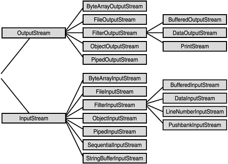

# java-core-notes
## When you make things faster it will make you slower
## Understand the concept, rather than memorizing the code
## Java
Là một ngôn ngữ lập trình biên dịch cấp cao được biết đến với các tính năng bảo mật mạnh mẽ, nhiều thư viện được xây dựng sẵn và nền tảng độc lập được phát triển bởi James Gosling và nhóm của ông tại Sun microsystem có tên đầu tiên là Oak và sau đó được đặt tên là Java dựa trên một loại cà phê trong Indonesia.  That very famous for "Write Once, Run Anywhere" qoute that has JVM.
## Java Virtual Machine
Đó là trình biên dịch Java Byte-code, là dạng mã đã biên dịch từ mã nguồn Java. Nó cũng chịu trách nhiệm xử lý việc thu gom rác để cấp phát và giải phóng bộ nhớ động.
## OOP (Object Oriented Programming)
Đó là tổ chức cấu trúc của mã mô phỏng các đối tượng thực tế thông qua các đối tượng phần mềm có hành vi và thuộc tính riêng của chúng. And has 4 Pillars of Inheritance, Polymorphism, Encapsulation, and Abstraction.
## Why java is not fully Object-oriented
Bacause of primitive types byte, short, int, long, float, and double.
## Java naming conventions
* **Classes should be noun, always capital letter for each word, and should match to the file name.**
```
Foo✅ file name should be Foo.java
FooBar✅ file name should be FooBar.java
```
* **Method should be verb and use camel casing.**
```
Foo foo = new Foo();
foo.greet()✅
foo.greetBar()✅
```
* **Variable should be noun and use camel casing.**
```
String foo;✅
int fooBar;✅
```
* **Constant Variable should be in snake case, always have value when declared, and all caps.**
```
float PI = 3.14;✅
int DEFAULT_VALUE = 1;✅
```
* **Note: Bằng cách viết mã dựa trên quy ước đặt tên, nó sẽ làm cho mã của bạn dễ đọc, có thể tuân theo mã chất lượng doanh nghiệp và khi đọc mã, bạn có thể xác định ngay lập tức phân biệt hàm, biến và lớp là gì.**

## Access modifiers
* **public**: can be used anywhere in the program
* **protected:** can only be used by child class and not avaiable globally.
* **private:** only available inside the specific class it was declared on
* **package-private:** the default access modifier that only available in the specific package it was declared on.
**Note:** In inheritance access modifier cannot be more restricted than the declared one. for example

| Modifier | Class | Package | Subclass | World
| ----------- | ----------- |----------- | ----------- | ----------- |
| public | Y | Y | Y| Y |
| protected | Y | Y | Y | N
| default | Y | Y | N | N |
| private | Y | N | N | N |
## Non-access modifiers

* **final:** Used to declare a constant variable, prevent methods from being overwritten, and prevent other classes from extending the class.
* **static:** Used for variables, methods, and classes that are not directly bound to an encapsulating class instance.

**Note:** Static methods and variables should be accessed via the class itself instead of an object instance.
## When to use static keyword?
* **Bạn nên sử dụng từ khóa "static" khi bạn muốn chia sẻ dữ liệu hoặc chức năng giữa tất cả các thể hiện của lớp mà không cần tạo thể hiện mới. Tuy nhiên, cần lưu ý rằng việc sử dụng quá nhiều biến và phương thức tĩnh có thể làm cho mã của bạn trở nên khó hiểu và khó bảo trì, vì chúng có thể tác động toàn cục và ảnh hưởng đến các phần khác trong ứng dụng của bạn.**
```
Foo foo = new Foo();
foo.getTotalFoo(); // static method in Foo class
instead
FooHelper.getTotalFoo(); // are much more readable and concise
```
## Variable scoping
* **Global variable: declared in encapsulating class that accesible anywhere in the class.**
* **Local variable: declared usually inside the method and only accessible within that method.**
```
public class Foo {
  private String bar; // Global scope available anywhere in this class
  public void greetBar() {
    String foo; // Local scope only available inside this method
  } 
}
```
**Note: Scoping of methods and variable in java are always only within the curly brackets {} it was declared on**
## Guard clause
* **Guard clause is used to invert the logic and return early if the there was an validation triggered.**
* **Prevent nested if else**
* **When you use guard clause you will never use else statement in your life.**
* **Used with conjunction of throwing an error or return.**
```
// old code
public void add(String name) {
  if (name.equals("bar")) {
     // Rest of the code
  } else {
     System.out.println("Your are not bar");
  }
}

// New code
public void add(String name) {
  if (!name.equals("bar")) {
    System.out.println("You are not bar");
    // Here we check immediately if hes bar and return or throw an error early.
    return;
    // throw new Exception
  }
  // Rest of the code
}
```
#### What are most prefer return or throw an error
* **Đối với tôi, việc đưa ra lỗi sẽ an toàn hơn nhiều vì bạn có thể đảm bảo rằng phần còn lại của mã sẽ không thực thi nếu xác thực được kích hoạt, không giống như lỗi trả về có thể ẩn nấp nếu mã tiếp tục thực thi sau khi xác thực được kích hoạt.**

## What is class
* **Class acts like a blueprint to create an object that has properties = fields and behavior = methods.**
## What is abstract class and method
### Abstract Class
* **Used for not to create uncessary object**
* **Abstract class cannot be instantiate or created**
### Abstract Method
* **Abstract method is a method that has no implementation/body**
* **Abstract method is meant to be overwritten.**
## What is interface
* **By default methods in interface are public and abstract**
* **By default fields in interface are public, final and static.**
* **Used when you need multiple inheritance.**
* **Used when you need just a contract that implementing class can do what method is declared in interface.**
* **Used when you dont need class heirarchy because interfaces bypass class heirarchy.**
* **Interface can have static methods and default methods**
## Difference between static and default method in interface
* **They both need a body/implementatiom when declared in interface**
* **Default method: Can be overwritten.**
* **Static method: Cannot be overwritten.**
## Inheritance
* **Used to achieve polymorphism**
* **Inheritance is used if theres a common fields and methods to make code reusable and readable.**
* **Also if you want to have a relation between to classes to mimic real world objects.**
```
public class Animal {
  private String name;
  public void eat() {}
}


public class Dog extends Animal {
  private String breed;
  public Dog(String name, String breed) {
    super(name);
    this.breed = breed;
  }

  @Override
  public void eat() {}
}
```
## Three types of inheritance
* **Single level: Class that extends in another class.**
* **Multi level: Extending to a class that extends to another class**
* **Heirarchial: The parent class has 1 or more child class.**
* 
**Note: statics can be inherited but cannot be overwritten.**
## Polymorphism
* **Poly có nghĩa là nhiều và hình thái có nghĩa là có nhiều cách biểu diễn.**
### Two types of Polymorphism
* **Static/ Compile time Polymorphism:** Achieved via method overloading meaning methods that have same name but return type, parameters types, and parameter ordering are not the same. Basically methods that only the same name are called method overloading.
```
public void m1() { }
public void m1(DataType arg1) { }
```
* **Dynamic/ Runtime Polymorphism:** Achieved via method overriding meaning child class can do what is declared in parent class but has its own implementation or behavior.
```
public class Person {
  public void greet() { }
}

public class Student extends Person {
  @Override
   public void greet() {
     System.out.println("Student is greeting");
   }
}

public class Teacher extends Person {
  @Override
  public void greet() {
    System.out.println("Teacher is greeting");
  }
}

// As you can see student and teacher are extending in person class that has greet method but when they override that method thats it you have polymorphism and they are now have their behavior how to do greet.
```
**Note: You cannot achieve method overriding without inheritance.**
## Encapsulation
* **Implementation level**
* **Wrapping up the implementation data members and methods in a class. Used for data hiding.**\
You can achieve this by simply using getters and setters.\
Usage of private and final keywords to hide and control what other class can access.
## Abstraction
* **Design level**
* **Meaning hiding unecessary details and only showing valuable information.**
* **For example: Khi bạn có xe và chìa khóa, bạn khởi động xe bằng chìa khóa và thế là xe hoạt động ngay. Nhưng làm thế nào để chìa khóa khởi động xe thì thông tin này chúng ta không cần biết nhưng quyền quan trọng của nó là việc kiêng cữ có nghĩa là che giấu những chi tiết không cần thiết và chỉ hiển thị những thông tin có giá trị.**
* **Example 2: There are two type of motor right manual that has clutch and automatic has only has accelerator and dont have clutch. Automatic abstracts the clutch that we dont need to manually manage the clutch instead automatically handling it behind the scenes that we dont to care about.**
## Difference of this and super keyword
* **this: is used to reference the methods and fields of current object.**
```
public class Foo {
  private String bar;
  public void Foo(String bar) {
    this.bar = bar;
    // here the this keyword contains the current class methods and variables that you can access.
  }
}
```
* **super: used to reference the methods and fields of super class.**
```
public class Foo {
  public void greet() {
  // Code here
  }
}

public class Bar extends Foo {
  @Override
  public void greet() {
    super.greet(); // Will call the super class greet() method
    this.greet() // Will call the this current class greet() method
  }
}
```
## What does new keyword do and instatiate means?
* **Từ khóa new được sử dụng để tạo = khởi động một đối tượng mới dựa trên lớp bạn đã tạo dưới dạng thiết kế của đối tượng.**
```
Foo foo = new Foo();
// The new Foo() is the instantiation of the object.

// The Foo foo is the just the type and the variable name.
```
## Annotation
* **Annotations is used to either add a metadata to a class, field, and method or Code documentation.
Add metadata example**
```
'@Retention'
'@Entity'
```
## Code Documentation
```
'@Override'
'@Depracated'
```
## Generics
* Used to have strong compiled time types and avoid type casting which commonly leads to bugs.
* Used when you need to a class, method, field that can work with different types. for example:
```
public interface Adder<T, U> {
 public void add(T t, U u) {
   System.out.println(t + u);
 }
}

// If you define a interface with different data type it will lead to class explosion instead use generics to have specific method can work with different types.
```
## Common generics naming convention
* Its naming convention in java that generics should have 1 letter name for readablity.

* E = element

* K = key

* N = number

* T = type

* V = value

* S = 2nd parameter

* U = 3rd parameter

* V = 4th parameter

* R = return type
## Enums
* **Used to represent a group of constant variables. Example: Deck of Cards, Months, and Genders.**
```
public enum Gender {
 MALE,
 FEMALE
}
```
## Exception handling
* **Việc hiểu sâu sắc cách tạo và đọc một phương thức (method) là rất quan trọng vì nó sẽ hữu ích khi gỡ rối lỗi (debug) và đọc code của người khác. Bởi vì Java là lập trình hướng đối tượng (OOP), logic thường được viết bên trong các phương thức. Bạn sẽ có thể tái sử dụng và cải thiện tính đọc hiểu của code vì có thể chia nhỏ các khối logic lớn thành các phương thức riêng biệt.**
```
// Method with void return type and no parameters
public void methodName() {

}
// public is the access modifier
// void is the return type
// methodName is the name of the method
// () is the parameters

// Method with return type and with parameters
public ReturnType methodName(DataType arg1, DataType arg2) {

}
// public is the access
// ReturnType is the return value of the method
// methodName is the name of the method
// (DataType arg1, DataType arg2) is the parameters
```
* **Note: void means nothing to return**
## Difference between parameter and argument
* **Argument: When you actually use or call the method and you supply the data inside the parameter is called argument.**
* **Parameter: When you declare a method inside () is called parameter.**
##### Về cơ bản khi bạn tạo một phương thức được gọi là tham số và khi bạn sử dụng phương thức đó, nó sẽ được gọi là đối số.
## What is Aggregation
* **Using other class as class member of another class for example.**
```
public class Person {
  private Car car;
}

private class Car {
  private Engine engine;
}

private class Engine { }
```
#### When to use aggregation
* **Use aggregation if you need a dependency from other class or you that class as class member. and has a relation of that can be read as 'has a' for example:** \
Person has a Car\
Car has a Engine
#### Difference between aggregation and inheritance
Ngày nay, aggregation thường được ưa chuộng hơn inheritance vì nó dễ dàng và nhanh chóng để triển khai hơn. Nhưng tôi thích sử dụng kế thừa hơn vì nếu không sử dụng kế thừa, bạn sẽ phải viết nhiều code hơn do các lớp của bạn không liên quan và bạn không thể tái sử dụng code vì aggregation dẫn đến sự phụ thuộc lẫn nhau giữa các lớp (coupling).
## When to use inheritance
* **Nếu có các trường và phương thức chung trong lớp cha và lớp con.**
* **Nếu các lớp của bạn có một mối quan hệ và mối quan hệ của chúng có thể được đọc cả dưới dạng is-a hoặc can-be chẳng hạn:**\
Car is a ElectricCar\
Car can be ElectricCar
## When to use interfaces
* **Khi bạn cần đa kế thừa vì java không cho phép đa kế thừa.**
* **Nếu các lớp của bạn cần một giao kèo (contract) để đảm bảo chúng có thể thực hiện các phương thức được khai báo trong interface.**
* **Và mối quan hệ của họ không thực sự quan trọng.**
## Difference of == operator and equals() method
* **== only check if two objects memory location are the same.**
* **equals() method check not the memory location but the content of the object.**
## Functional Interface
* **là một inteface và có một phương thức trừu tượng nhưng có thể có bất kì default and static method**
* **Also used to create a lambda expression because this Functional Interface will become the type of the lambda expression this is where we will store our lambda expression**
```
public interface MyFunctionalInterface {
  void m1() { }
}
```
### Lambda expression/Anonymous Functions
* **Introduced in Java 8 that allows functional programming in java.**
* **Reduce boilerplate code**
* **Code optimization**
* **Used for data extraction in Collection**
* **In lambda data is stored in functions and variables**
* **You can think of it as short hand to in writing a method.**
```
// Without lambda expression
public interface Adder<T, U> {
  void add(T num1, U num2);
}

public class IntegerAdder implements Adder<Integer, Integer> {
 @Override
public void add(Integer num1, Integer n2) {
  System.out.println(num1 + num2);
}

// With lambda expression
Adder<Integer, Integer> integerAdder = (num1, num2) -> System.out.println(num1 + num2);

() -> {}
// () is the argument list
// -> is the lambda expression sytax
// {} is the method body
```
* **Lambda expression compare to OOP**
```
// OOP
access modifier✅
return type✅
method name✅
curly braces✅
public void m1() {
 System.out.println("Hi");
}

// Lambda expression
access modifier❎
return type❎
method name❎
curly braces❎
MyFunctionalInterface myFunctionalInterface = () -> System.out.println("Hi");
```
* **Như bạn có thể thấy, chúng tôi gần như đã loại bỏ tất cả các mã soạn sẵn không cần thiết và kết thúc bằng cách viết một phương thức ngắn gọn.**
##### Question: How does JVM knows what is return type, access modifier, , parameter list, and method name if we removed it?
##### Answer: JVM sẽ tham chiếu dựa trên chữ ký phương thức mà bạn đã xác định trong functional interface, đó là lý do tại sao nó có thể xác định phương thức nào sẽ gọi, kiểu trả về là gì, công cụ sửa đổi truy cập, danh sách tham số và tên phương thức là gì.
#### Note:
* **Nếu chỉ có 1 dòng bạn cũng có thể bỏ dấu ngoặc nhọn. nhưng có 2 dòng trở lên bạn cần bao gồm dấu ngoặc nhọn.**
```
// One line
MyFunctionalInterface myFuntionalInterface = () -> System.out.println();

// Two or more lines
MyFunctionalInterface myFuntionalInterface = () -> {
  // Other code
}
```
* **Nếu danh sách đối số chỉ có 1, bạn cũng có thể xóa dấu ngoặc đơn mở/đóng. nhưng có 2 cái trở lên bạn cần thêm dấu ngoặc mở/đóng.**
```
// One argument
MyFunctionalInterface myFuntionalInterface = arg1 -> System.out.println();

// Two or more argument
MyFunctionalInterface myFuntionalInterface = (args1, args2) -> System.out.println();
```
* **Nếu lambda của bạn có kiểu trả về và bạn chỉ có 1 dòng mã thì bạn không cần phải viết từ khóa return. nhưng nếu bạn có kiểu trả về và có 2 dòng trở lên, bạn cần thêm từ khóa return.**
```
// One line
MyFunctionalInterface myFuntionalInterface = () -> "Hello World";

// Two or more lines
MyFunctionalInterface myFuntionalInterface = () -> {
  // Other code
  return "Hello World";
}
```
## Pre-defined Functional Interfaces
* **Predicate**\
boolean test(T t)\
**Predicate chaining**
```
Predicate<T> and(Predicate<T> predicate)
Predicate<T> or(Predicate<T> predicate)
Predicate<T> negate()
```
* **BiPredicate<T, U>**\
boolean test(T t, U u)
* **Consumer**\
void accept(T t)
* **Consumer chaining**
```
Consumer<T> andThen(Consumer<T> consumer)
```
* **BiConsumer<T, U>**\
void accept(T t, U u)
* **Function<T, R>**\
R apply(T t)
* #### Function chaining
```
Function<T, R> andThen(Function<T, R> function)
Function<T, R> compose(Function<T, R> function)
```
* **BiFunction<T, U, R>**\
R apply(T t, U u)
* **Supplier**\
R get()
#### Conclusion for lambda expression
* **Cách truyền thống của OOP là triển khai một functional interface và tạo một lớp mới để triển khai nó. Và khi bạn cần một hành vi khác, bạn sẽ tạo lớp mới và triển khai lại nó, điều này dẫn đến bùng nổ lớp, nhiều mã soạn sẵn hơn và mã xấu. Đó là lý do tại sao chúng ta cần biểu thức lambda để tránh điều đó và cũng đạt được lập trình hàm.**
## Method Reference
* Được sử dụng thay thế biểu thức lambda bằng phương thức hiện có để duy trì khả năng đọc và mã hóa bảo mật.
* :: symbol is used to reference to method.
#### 4 types of method reference
* **static reference**
```
ClassName::staticMethod
```
* **instance method of other object**
```
otherObject::instanceMethod
```
* **instance method of specific object your working on**
```
specificObject::instanceMethod
```
* **constructor reference**
```
ClassName::new
```
#### Khi viết tham chiếu phương thức () của phương thức tham chiếu không cần thiết chỉ cần tên của tham chiếu phương thức.
#### Bạn có thể coi tham chiếu phương thức là lambda dưới dạng phương thức bình thường vì bạn nhận thấy lambda chỉ là cú pháp ngắn gọn của phương thức, vì vậy nếu bạn muốn lambda của mình có tên, bạn có thể sử dụng tham chiếu phương thức.
## Java 8 Features
* **StringJoiner**
* **Lambda Expression**
* **@FunctionalInterfaces annotation**
* **Date Time API**
* **Stream API**
* **Optional class**
* **Static and default methods in interface**
## 
## Definition of Terms
* **Instatiate = Create**
* **Implicit = Automatic**
* **Explicit = Manual**
* **Sub class, Derived class and Child class are all the same.**
* **Super class, Base class and Parent class are all the same.**
* **Method, Function, and Behavior are all the same.**
* **Field, Property, Variable are all the same.**
## IO
## 2 Types of Streams in Java
### Bytes
* **InputStream == Read**
* **OutputStream == Write**
#### Any thing that ends with Stream its used for bytes
* 
### Character
* **Writer = Writing**
* **Reader = Reading**
#### Anything that ends with reader or writer its used for characters


